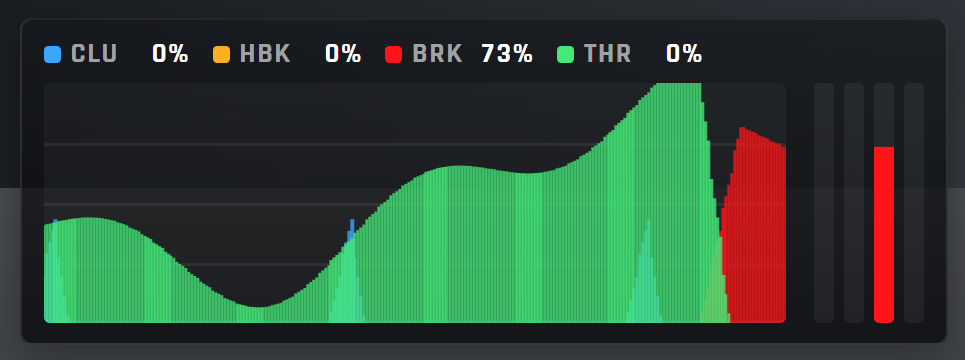
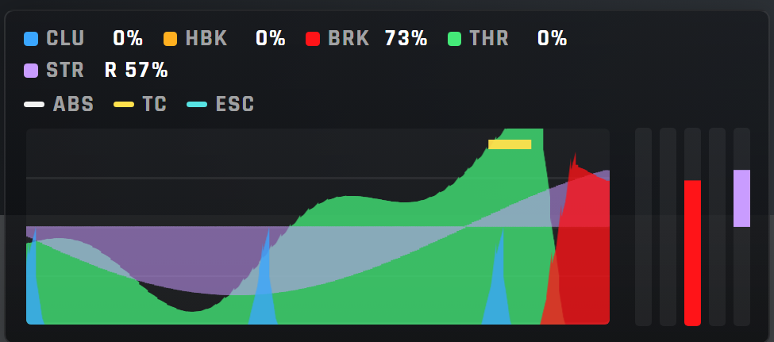

# ACE PedalGraph

A HUD widget for Assetto Corsa EVO that draws a scrolling graph of throttle, brake, clutch, handbrake and steering input, with marks where ABS, TC or ESC stepped in, loaded by the [ACE UI App Loader](https://github.com/dreasgrech/ACEUIAppLoader) and built on its library.

It is also the **reference app**: the smallest complete example of the shape every other app here follows, and the one to copy from.

<p align="center"></p>
<p align="center"><br><sub>Rendered by <code>dev/preview.html</code> with the game's typeface; in game the panel sits over the track.</sub></p>

## Installing

With the loader installed, this app is a folder and an empty marker file:

```
Saved Games\ACE\mods\uiresources\ACEUIAppLoader\pedalgraph\
Saved Games\ACE\Video\ACEUIAppLoader-pedalgraph.settingspreset
```

It overrides no game file — it is a loose folder the game reads, found through its marker.

From a checkout, with the loader repo beside this one:

```
python ..\ACEUIAppLoader\tools\install_app.py pedalgraph
python ..\ACEUIAppLoader\tools\install_app.py --remove pedalgraph
```

Escape and resume in the car reloads the HUD and picks up changes.

## Options

The app drawer's **OPTIONS** button opens the widget's settings window. Everything is stored by the loader and survives the HUD reload and a restart. The window is in five sections; click a header to fold it, and the fold is remembered.

| Section | Option | What it does |
|---|---|---|
| **Layout** | Panel scale | 0.6 to 2, in steps of 0.1. One font-size on the root; everything inside is sized in em. |
| | History | 3 s, 5 s or 10 s of input across the graph. The bar count is fixed, so a longer window is a slower sampler (83, 50 or 25 Hz). |
| | Plot height | `low`, `normal` or `tall`: a wide low strip under the car, or a taller graph for reading trail-braking. |
| **Inputs** | Throttle, Brake, Handbrake, Clutch, Steering | Draw or hide each input: its legend entry, its trace and its level bar. A hidden input keeps recording, so switching it back on shows the history it has. Steering is off by default; it draws from the centre line, right upward, and its readout says which way (`L 42%`). |
| **Assist marks** | ABS, TC, ESC | Off by default. A thin tick along the top of the graph, one row each, wherever that assist was active: where the electronics stepped in against your inputs. |
| **Look** (folded) | Traces | `faint`, `normal` or `bold`: how solid the bars are drawn, for over a busy background or none. |
| | Background | `dark` (the default), `light`, or `none` for just the traces over the game. |
| | Level bars | The live value of each input, beside the graph. |
| | Readouts | The live value of each input, in the legend. |
| | Grid lines | The 25 / 50 / 75 % reference lines. |
| **Draw order** (folded) | a list you drag | Which input paints over which: the top of the list is drawn on top. Default is brake, clutch, steering, handbrake, throttle. The assist marks always sit above. |
| **Demo** (folded) | Attract mode | Scripted inputs, for recording without driving. `PedalGraph.attract(true)` in the dev console does the same. |

**Reset to defaults** at the bottom puts every value back (the folds stay as you left them). Nothing hidden costs a frame: every option is a class on a fixed element, and the loop skips the writes for what is not drawn.

## What it is made of

The widget reads the game's `ModelCurrentCar` (`gas_percent`, `brake_percent`, `clutch_percent`, `handbrake_percent`, `steering_percent`, and the `abs_active` / `tc_active` / `esc_active` flags) and animates a fixed set of bars with CSS transforms. Steering is signed, −1 to 1, the range the stock speedo clamps it to. Everything that is not the graph comes from the library:

| | |
|---|---|
| `ACEUIAppLoader.panel` | drag, and a position stored as a fraction of the screen so it survives the HUD reload |
| `ACEUIAppLoader.loop` | the frame loop and the fixed-rate sampler |
| `ACEUIAppLoader.settings` | the options: declared once, stored by the loader, drawn in the app's settings window |
| `me.scale` | the panel scale, as one font-size on the root |
| `ACEUIAppLoader.app("pedalgraph")` | name, version, title, root, logger and storage keys — so none of them is repeated in the source |

Each pedal's bar is a trapezoid from the previous sample to its own (a `translateY` and a `skewY`), so a trace is piecewise linear rather than a staircase of columns, and a fast clutch blip is a spike rather than a comb. It writes no colours or sizes, only transforms and classes; every class name, timing and precision is a named constant. The version lives in `pedalgraph/app.json` and nowhere else.

## Preview outside the game

Open `dev/preview.html` in Edge or Chrome — double-click, no server needed. It loads the library from the sibling loader checkout, then the real `pedalgraph.css` and `pedalgraph.js`, inside a 16:9 stand-in for the game's HUD container, and feeds them a fake `ModelCurrentCar`.

- `W` throttle, `S` brake, `A` clutch, `Space` handbrake, `←` `→` steering, with pedal travel smoothing — or leave **auto demo** on for a scripted lap; the fake car's ABS works under hard braking and its TC on a full throttle
- **hide HUD** toggles `body.hide-hud` like the game's own HUD toggle
- **focused car** toggles `has_focused_car`, the spectator case
- **reset position** clears the stored position; dragging persists as it does in game
- **options** opens the same settings window the app drawer opens in game
- flags after `#` in the URL: `#all` switches every channel and mark on, `#options` opens the settings window, `#reset` restores the defaults, `#shot` drives frames from timers for headless screenshots (comma-separate to combine: `preview.html#all,options`)

Run `python tools/preview_fonts.py` once to copy the game's typeface (Rajdhani) out of the installed game beside the preview; until then a system font stands in. The copies land in `dev/fonts/`, which git ignores.

What it cannot show: anything Cohtml-specific (this is Chromium), the stock HUD around the widget, and the game's font. Per-frame rendering still needs one real launch — see [`docs/notes.md`](docs/notes.md).

## Tests

```
python -m unittest discover -s tests -v
```

`tests/test_app.py` runs the loader's shared test kit pointed at this repo, plus the widget's own contract; `tests/widget/harness.html` holds the browser cases. Clone `ACEUIAppLoader` and `ACEGameInternals` beside this repo — the preview and the tests load the library and the shared fixtures from `../ACEUIAppLoader/`.

## Layout

```
pedalgraph/
  app.json          version, title, stylesheet and script
  pedalgraph.js     the widget: PedalGraph.attach(root) / .detach(state)
  pedalgraph.css    all styling in em, channel colours keyed by data-trace index, one class per option
dev/preview.html    the widget outside the game
tools/preview_fonts.py   copies the game's font beside the preview (into dev/fonts/, ignored)
docs/images/        the two renders above
tests/
  test_app.py       the shared kit plus this app's contract
  widget/harness.html   the browser cases
docs/notes.md       rendering rules, versioning, and how to verify a change in game
```

### Style

No classes, no `this`, no `var`, no arrow functions, no function declarations; one self-invoking module per file, four-space indent, double quotes. The loader's test kit enforces it — see [`docs/style.md`](https://github.com/dreasgrech/ACEUIAppLoader/blob/main/docs/style.md) there.

Everything learned about the game and its UI engine lives in [`ACEGameInternals`](https://github.com/dreasgrech/ACEGameInternals).
